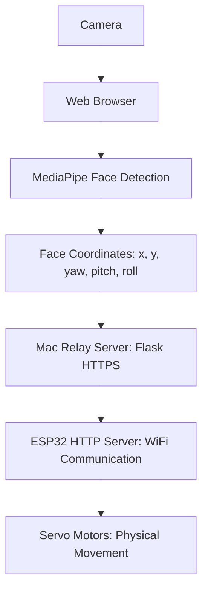

# 2026 Capstone Face Tracker

실시간 얼굴 추적으로 서보 모터를 제어하는 로봇 시스템입니다.

카메라로 사용자의 얼굴 위치와 머리 방향을 인식하고, ESP32를 통해 서보 모터를 제어하여 사용자를 추적하는 것을 목표로 합니다.

## 시스템 아키텍처



데이터 흐름:

1. 웹 브라우저에서 카메라로 실시간 영상을 획득합니다.
2. MediaPipe로 얼굴 랜드마크를 추출하고 좌표를 계산합니다.
3. HTTPS를 통해 중계 서버로 얼굴 데이터를 전송합니다.
4. 중계 서버가 ESP32로 HTTP 요청을 전달합니다.
5. ESP32에서 서보 모터 제어 신호를 생성합니다.

## 프로젝트 구조

```text
2026-Capstone-Face-Tracker
├── Code/
│   ├── index.html                 # 웹 얼굴 추적 인터페이스
│   ├── server.py                  # Flask 중계 서버
│   ├── face_landmarker.task       # MediaPipe 모델 파일
│   └── EC2_0512_ver/              # ESP32 펌웨어, 기존 버전
├── modeling/                      # 3D CAD 모델 및 발표 자료
├── simul.py                       # 시뮬레이션/테스트 코드
├── specification.md               # 상세 기술 명세
└── index.html                     # 테스트용 HTML
```

## 기술 스택

| 분야 | 기술 |
| --- | --- |
| 프론트엔드 | HTML5, JavaScript, MediaPipe |
| 백엔드 | Python, Flask |
| 하드웨어 | ESP32, 서보 모터 |
| 통신 | Wi-Fi, HTTPS, HTTP |
| 얼굴 인식 | MediaPipe Face Landmarker |
| 3D 모델링 | Autodesk Inventor |

## 얼굴 인식 시스템

웹 인터페이스는 `Code/index.html`에 있습니다. 브라우저 카메라 영상을 받아 MediaPipe Face Landmarker를 실행하고, 얼굴이 감지되면 주요 랜드마크를 기준으로 위치와 방향 값을 계산합니다.

주요 랜드마크:

| Landmark | 위치 | 용도 |
| --- | --- | --- |
| 33 | 왼쪽 눈 바깥쪽 | 얼굴 너비 기준점 |
| 263 | 오른쪽 눈 바깥쪽 | 얼굴 너비 기준점 |
| 1 | 코 끝 | 얼굴 중심 계산 |
| 13 | 입 중심 | 수직 기준점 |

추출 데이터:

```javascript
{
  "x": "center offset x",
  "y": "center offset y",
  "yaw": "left-right rotation value",
  "pitch": "up-down rotation value",
  "roll": "tilt value"
}
```

자동 전송 모드에서는 설정한 주기마다 다음 API로 데이터를 전송합니다.

```text
GET https://<server-ip>:8443/set?x=<x>&y=<y>&yaw=<yaw>&pitch=<pitch>&roll=<roll>
```

## 중계 서버

중계 서버는 `Code/server.py`에 있습니다. 웹 브라우저에서 HTTPS 요청을 받고, ESP32에는 HTTP 요청으로 다시 전달합니다.

서버 실행:

```bash
cd Code
python server.py
```

필요한 Python 패키지:

```bash
pip install flask flask-cors requests
```

기본 실행 주소:

```text
https://0.0.0.0:8443
```

ESP32 주소는 `Code/server.py`의 `ESP32_URL` 값을 실제 ESP32 IP에 맞게 수정해야 합니다.

```python
ESP32_URL = "http://192.168.71.55/set"
```

HTTPS 실행을 위해 `cert.pem`, `key.pem` 인증서 파일이 필요합니다.

## ESP32 펌웨어

ESP32 Arduino 코드는 `Code/EC2_0512_modular/`에 있습니다.

모듈화 버전 구성:

| 파일 | 역할 |
| --- | --- |
| `EC2_0512_modular.ino` | `setup()`, `loop()`, 서버 등록 |
| `global.h` | Wi-Fi, 서버, 서보, 핀 번호, 전역 변수 |
| `SetupModules.ino` | Wi-Fi 연결, 서보 초기화 |
| `HttpHandlers.ino` | `/set` 요청 처리 |
| `InputControl.ino` | 입력값을 동작 명령으로 변환 |
| `MachineMotion.ino` | 기계 동작 단위 함수 |
| `LowLevel.ino` | 개별 서보 직접 제어 |

ESP32는 Wi-Fi에 연결한 뒤 80번 포트에서 HTTP 서버를 실행합니다.

주요 API:

```text
GET /set?x=<x>&y=<y>&yaw=<yaw>&pitch=<pitch>&roll=<roll>
```

개별 서보 직접 제어:

```text
GET /set?servo1=90
GET /set?servo2=120
GET /set?servo3=45
GET /set?servo4=135
```

명령 기반 제어:

```text
GET /set?command=left
GET /set?command=center
GET /set?command=right
```

현재 yaw 제어는 단순 방향 제어 방식입니다.

```text
yaw < 0  -> left
yaw = 0  -> center
yaw > 0  -> right
```

## 서보 모터 설정

| Servo | GPIO |
| --- | --- |
| Servo 1 | 18 |
| Servo 2 | 19 |
| Servo 3 | 21 |
| Servo 4 | 22 |

초기 각도는 모두 90도입니다.

## 실행 방법

### 1. ESP32 펌웨어 업로드

Arduino IDE에서 `Code/EC2_0512_modular/EC2_0512_modular.ino`를 엽니다.

업로드 전 다음 값을 실제 환경에 맞게 수정합니다.

```cpp
const char* ssid = "YOUR_WIFI_SSID";
const char* password = "YOUR_WIFI_PASSWORD";
```

필요하면 static IP, gateway, subnet, servo GPIO pin도 함께 수정합니다.

### 2. 중계 서버 실행

```bash
cd Code
python server.py
```

서버 주소:

```text
https://0.0.0.0:8443
```

### 3. 웹 인터페이스 실행

1. 브라우저에서 `Code/index.html`을 엽니다.
2. 카메라 권한을 허용합니다.
3. 서버 IP를 `<your-ip>:8443` 형식으로 입력합니다.
4. `신호 테스트` 또는 `자동 전송`을 실행합니다.

### 4. 연결 확인

- ESP32 Serial Monitor에서 Wi-Fi 연결 상태를 확인합니다.
- 웹 화면에서 얼굴 인식이 정상적으로 동작하는지 확인합니다.
- 얼굴 움직임에 따라 서보 모터가 동작하는지 확인합니다.

## 현재 구현 상태

- 웹에서 얼굴 랜드마크 감지 가능
- 웹에서 얼굴 중심 오차와 yaw, pitch, roll 유사 값 계산 가능
- Flask 중계 서버를 통한 ESP32 값 전달 가능
- ESP32에서 `/set` 요청 수신 가능
- ESP32에서 yaw 값 또는 command 값으로 Servo 1 제어 가능
- ESP32에서 `servo1`부터 `servo4`까지 직접 각도 제어 가능

